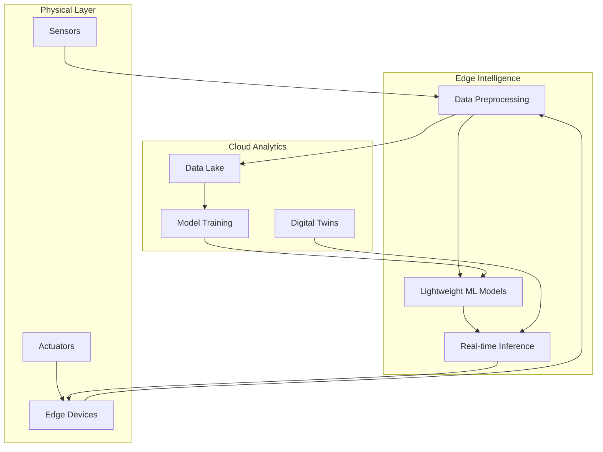

# Cyber Physical Laboratory


> **Where Bits Meet Atoms** - Pioneering the future of intelligent connected systems through cutting-edge research in IoT, Artificial Intelligence, and Machine Learning.

The **Cyber Physical Laboratory** is an interdisciplinary research hub dedicated to advancing the frontiers of intelligent systems. We bridge the gap between digital intelligence and physical reality, creating solutions that transform industries and enhance human experiences.

### Core Focus Areas

| Domain | Research Focus | Applications |
|--------|---------------|-------------|
| **Intelligent IoT** | Edge AI, Sensor Fusion, Distributed Computing | Smart Cities, Industrial IoT, Environmental Monitoring |
| **Machine Learning** | Deep Learning, Reinforcement Learning, Federated Learning | Predictive Maintenance, Anomaly Detection, Autonomous Systems |
| **Cyber-Physical Systems** | Real-time Systems, Control Theory, Security | Robotics, Autonomous Vehicles, Smart Infrastructure |
| **Connected Intelligence** | 5G/6G Networks, Cloud-Edge Continuum, Digital Twins | Telemedicine, Smart Agriculture, Energy Grids |

---

## Research Projects

### Active Projects

#### **Project Aegis** - Smart Security Systems
```python
# Intelligent Threat Detection
class SmartSecurity:
    def __init__(self):
        self.iot_sensors = MultiModalSensors()
        self.ml_engine = ThreatDetectionModel()
        self.response_system = AdaptiveControl()
    
    def monitor_environment(self):
        return "Real-time anomaly detection with 99.2% accuracy"
```

**Tech Stack:** `TensorFlow` `ROS` `MQTT` `ESP32` `Python`

#### **Project Gaia** - Environmental Intelligence


**Features:**
- Multi-sensor environmental monitoring
- AI-powered pollution prediction
- Autonomous response systems

#### **Project Hermes** - Autonomous Delivery Systems
**Innovations:**
- Swarm robotics for logistics
- Reinforcement learning for path optimization
- Blockchain for secure transactions

### Project Statistics

<div align="center">

| Metric | Current | Target |
|--------|---------|--------|
| **IoT Devices Deployed** | 150+ | 500 |
| **ML Models in Production** | 25 | 100 |
| **Research Papers** | 42 | 100+ |
| **Real-time Data Points/Day** | 10M | 50M |

</div>

---

## Technology Ecosystem

### Core Technologies

```yaml
Hardware:
  - Microcontrollers: "ESP32, Arduino, Raspberry Pi"
  - Sensors: "LiDAR, Thermal, Multi-spectral, Biometric"
  - Actuators: "Servo Motors, Solenoids, Smart Relays"
  - Communication: "LoRaWAN, 5G, Bluetooth Mesh, Zigbee"

Software:
  - ML Frameworks: "TensorFlow, PyTorch, Scikit-learn"
  - Edge Computing: "AWS Greengrass, Azure IoT Edge"
  - Data Platforms: "Apache Kafka, InfluxDB, TimescaleDB"
  - Visualization: "Grafana, Kibana, Custom Dashboards"

AI/ML Stack:
  - Computer Vision: "OpenCV, YOLO, CNN Architectures"
  - NLP: "Transformers, BERT, GPT-based models"
  - Time Series: "LSTM, Prophet, ARIMA"
  - Reinforcement Learning: "DQN, PPO, SAC"
```

### Architecture Overview

<div align="center">



</div>

---

## Research & Publications

### Recent Publications

| Year | Title | Conference | Impact |
|------|-------|------------|--------|
| 2024 | "Interpretable IoT-Enabled Machine Learning Framework on Optimized Climate Information for Crop Yield and Resource Usage" | Tailor $ Francis Book | **Book Chapter** |
| 2024 | "Generalized and Fine-Grained Remote Sensing Image Identification using Lightweight CNN and Color-Space Attention with XAI" | CCIS series | **Book Chapter** |
| 2023 | "An Adaptive Machine Learning Approach for Electrical Fault Detection and Minimization" | IEEE | **Conference Paper** |

### Awards & Recognition

<div align="center">


</div>

---

## Our Team

### 🔬 Leadership
- **Dr. Md. Dulal Haque** - *Director, AI Research*
- **Dr. Md. Shahzamal** - *Director, ML Engineering*

### 🎯 Research Groups

| Group | Focus | Members |
|-------|-------|---------|
| **Intelligent Sensing** | Multi-modal sensor fusion | 8 Researchers |
| **Edge Intelligence** | On-device ML optimization | 6 Engineers |
| **Autonomous Systems** | Robotics & Control | 10 Specialists |
| **Data Analytics** | Large-scale IoT analytics | 7 Data Scientists |

---

## Lab Infrastructure

### Physical Setup

| Facility | Equipment | Capacity |
|----------|-----------|----------|
| **IoT Testbed** | 200+ sensor nodes, RF equipment | 24/7 operation |
| **AI Workstation** | NVIDIA DGX, High-performance computing | 50 TFLOPS |
| **Prototyping Lab** | 3D printers, PCB fabrication | Rapid prototyping |
| **Secure Network** | Isolated research network | 10 Gbps throughput |

### Digital Infrastructure

```json
{
  "compute_resources": {
    "cloud_gpu": "200,000 GPU hours/month",
    "edge_devices": "500+ deployed units",
    "data_storage": "2PB distributed storage"
  },
  "monitoring": {
    "real_time_dashboards": "15+ active",
    "alert_systems": "Multi-level escalation",
    "performance_metrics": "99.95% uptime"
  }
}
```

---

## Collaboration & Partnerships

### Industry Partners
<div align="center">


</div>

### Academic Network
- **MIT Media Lab** - Joint research in human-computer interaction
- **Stanford AI Lab** - Collaborative ML research
- **ETH Zurich** - Cyber-physical systems security

---

## Impact & Metrics

### Key Achievements

```python
class LabImpact:
    def __init__(self):
        self.patents_filed = 15
        self.products_launched = 8
        self.companies_spunoff = 3
        self.research_citations = 1200
        
    def social_impact(self):
        return {
            'lives_touched': '1M+',
            'energy_saved': '50 GWh',
            'carbon_reduced': '10K tons'
        }
```

### Real-time Lab Status

<div align="center">


</div>

---

## Future Roadmap

### Q4 2024
- [ ] Deploy city-scale digital twin
- [ ] Launch federated learning platform
- [ ] Publish 10+ research papers

### 2025 Vision
- [ ] Develop quantum-resistant CPS security
- [ ] Establish international testbeds
- [ ] Scale to 1000+ IoT nodes

---

## Connect With Us

<div align="center">

### Website & Portal
[](https://cyberphysicallab.edu)
[](https://researchgate.net/cyberphysical)

### Social & Updates
[](https://twitter.com/CyberPhysicalLab)
[](https://linkedin.com/company/cyberphysicallab)

### Contact Information
**Email:** research@cyberphysicallab.edu  
**Phone:** +1 (555) 123-4567  
**Address:** 123 Innovation Drive, Tech Park, CA 94025

</div>

---

## License & Acknowledgments

```text
Copyright 2024 Cyber Physical Laboratory

Licensed under the Apache License, Version 2.0 (the "License");
you may not use this software except in compliance with the License.
Unless required by applicable law or agreed to in writing, software
distributed under the License is distributed on an "AS IS" BASIS,
WITHOUT WARRANTIES OR CONDITIONS OF ANY KIND, either express or implied.
```

<div align="center">

### **Shaping the Future, One Intelligent System at a Time**


</div>
